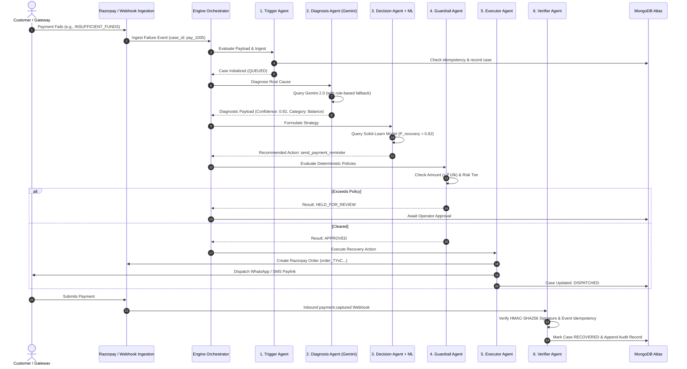

# Deep-Dive: The 7-Stage Recovery Pipeline

> Technical specification of RecoverAI's multi-agent autonomous payment recovery engine.

---

## Architecture Flow & Sequence Diagram

---

## Pipeline Stage Specifications

### Stage 1: Trigger Agent (`app/agents/trigger_agent.py`)
- **Input**: Raw transaction failure webhook payload.
- **Validation**: Verifies required fields (`id`, `amount`, `customer_id`, `error_code`, `payment_method`).
- **Idempotency**: Asserts that this failure event hasn't already been processed or claimed.
- **Output**: Canonical recovery case document stored in `recovery_cases` collection with initial status `INITIALIZED`.

### Stage 2: Diagnosis Agent (`app/agents/diagnosis_agent.py`)
- **AI Core**: Google Gemini 2.0 Flash (`gemini-2.0-flash`).
- **Prompt Isolation**: System instructions restrict outputs to structured JSON schema:
  - `root_cause_category`: Technical, Balance, Authentication, or Network.
  - `customer_intent_score`: Estimated willingness to pay (0.0–1.0).
  - `summary`: One-sentence explanation for human operators.
- **Fail-Safe Mechanism**: If Gemini quota is exceeded or network times out, the engine deterministically falls back to regex-mapped error catalog lookups without crashing.

### Stage 3: Decision Agent (`app/agents/decision_agent.py`) & Strategy Optimizer
- **Strategy Selection Matrix**:
  - `INSUFFICIENT_FUNDS` + High LTV $\rightarrow$ Soft WhatsApp reminder after 4 hours + 0% discount.
  - `CARD_EXPIRED` $\rightarrow$ Urgent update-payment-method email + UPI alternative rail.
  - `NETWORK_ERROR` $\rightarrow$ Automated gateway retry in 15 minutes.
  - Repeated Failure $\rightarrow$ Micro-discount offer (capped at 5%).
- **ML Integration**: Reads inference from `app/ml/predictor.py` to evaluate Expected Monetary Value ($EMV = P_{recovery} \times Amount$).

### Stage 4: Guardrail Agent (`app/agents/guardrail_agent.py`)
- **Deterministic Enforcers**:
  1. **Maximum Autonomous Cap**: Any transaction $\ge$ ₹10,000 must be approved by an authorized merchant operator.
  2. **High-Risk Blacklist**: Customers with previous chargebacks or disputes cannot receive discounts.
  3. **Velocity / Anti-Spam Check**: Max 3 recovery communications per transaction lifecycle.
- **State Transition**: Cases failing any policy enter `HELD_FOR_REVIEW`. Cases passing enter `APPROVED_FOR_EXECUTION`.

### Stage 5: Executor Agent (`app/agents/executor_agent.py`)
- **Gateway Interfacing**: Calls Razorpay API to generate a new `order` instance with custom receipt tags.
- **Message Rendering**: Formats customized communication templates using `app/services/message_service.py` with deep-links to payment gateways.

### Stage 6: Verifier Agent (`app/agents/verifier_agent.py`)
- **HMAC Verification**: Validates `X-Razorpay-Signature` against the webhook secret using `hmac.new(secret, body, hashlib.sha256)`.
- **Atomic State Lock**: Transitions case to `RECOVERED`, logs recovered revenue amount, and attributes recovery to the specific agent strategy.

### Stage 7: Feedback Loop & Retraining (`app/ml/retrain.py`)
- Allows human operators to rate agent decisions (thumbs up / thumbs down / override reason).
- Stores feedback into `recovery_feedback` collection.
- Retraining pipeline periodically fine-tunes logistic regression coefficients to optimize future predictions.
